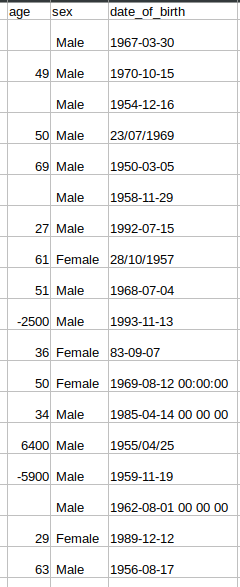
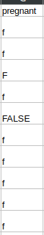

Nevhodná štruktúra dát (dáta nie sú v tabuľkovej podobe alebo jedna entita je opísaná viacerými riadkami tabuľky)  
Duplicitné záznamy, resp. nejednoznačné mapovanie medzi záznamami  
Nejednotné formáty dát  
Chýbajúce hodnoty  
Vychýlené (odľahlé) hodnoty  
a ďalšie, t. j. v dátach sa môžu nachádzať aj iné, tu nevymenované problémy, 
    ktoré tiež treba identifikovať a vo vašej analýze adresovať.  

--> Subor personal.csv   
    - tento subor obsahuje rozne chyby ako nejednotne formaty datum narodenia, alebo neobsahuje vek
    

    
   - oba tieto problemy sa daju riesit. Pri datum si vyberieme nejaky format a nasledne vsetky don prevedieme 
        tie, ktore sa nebudu dat budeme musiet rucne alebo ich zvolime ako nezname
   - pokial budeme opravovat formaty datum vieme automaticky opravovat aj vek ci uz len kontrolovat alebo aj doplnat

--> Subor other.csv
    - obsahuje nekonzistentny format ci je pacient tehotny teda toto zmenime na "False" "True" podla hodnoty
 
    
 
   - occupation, country, workclass ako nezname nebudeme menit (?)
   - pricom workclass pokial nebude nic obsahovat tak vlozime "?"
   - co sa tyka stlpca medical_info pokial tento stlpec nebude nic obsahovat vlozime donho json s nulovymi hodnotami
   - udaje ktore su v medical_info budeme parsovat z JSONU na dict ten nasledne pozbierame a vytvorime z neho DataFrame
        ktory nasledne vlozime do povodnych dat a ulozime. Pred tym ale budeme musiet jednotlive hodnoty parsnut na float numpy
   - tento bod sme uz museli vykonvat aby sa nam lahsie spracovala prva uloha a dalej vedeli pouzivat data a postupovat v zadani
   - spajat udaje s person.csv budeme vkada menu a priezvisku kedze nevieme ci id su v rovnakych poradiach
   - vychylene hodnoty po identifikovani vyhodime z datasetu no len v danej ulohe, hlavne tam kde to bude potrebne, pre istotu
        ze ine vysledky budu spravne
   - pokial pacient nema rasu tam vlozime other alebo ? ako unknown nech nam to neznehodnoti statistiky
    

